# Events

Events are what NFT-TiX are all about! Many paths through our site — including browsing and searching — will lead you to a special event. All event pages have contain the event's basic information, one or more tiers of tickets, and other events put on by that organisation. 

The top of this page describes the event details, the bottom the purchasing experience.

Each event page looks similar to the following screenshot.

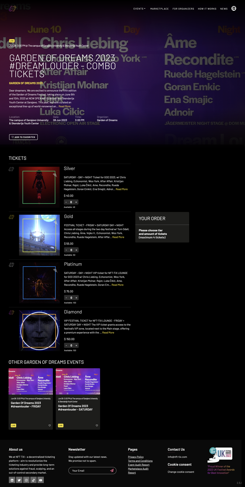

## Basic event information

The basic event information portion contains

* An icon to show whether it's live
* Summarized event date and location
* The event name
* A description of the event
* The location, date, time, and event organizer
* A widget to add this event to your Favorites list


## Event ticket tiers

The event ticket tier portion will show at least one ticket type; often more. The event shown here has:

* Silver — One-day day & night 
* Gold — Two-day day & night
* Platinum — One-day VIP lounge day & night
* Diamond — Two-day VIP zone day & night

Each event may have different tiers, each of which may grant the purchaser different perks.

Each tier will have a widget to select the desired number of tickets and shows the number of currently available tickets for that tier.

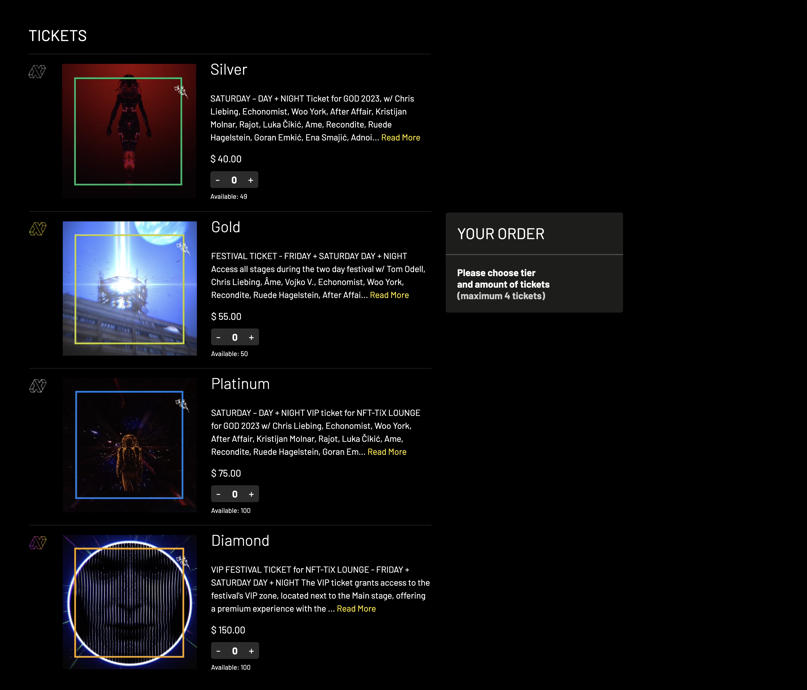

## Other events

Lastly shown are other events put on by the same organisation.

# Purchasing tickets

## Adding tickets to your order

Adding a ticket to your order with the `+ -` widget brings up a purchase summary section with a `BUY NOW` button.

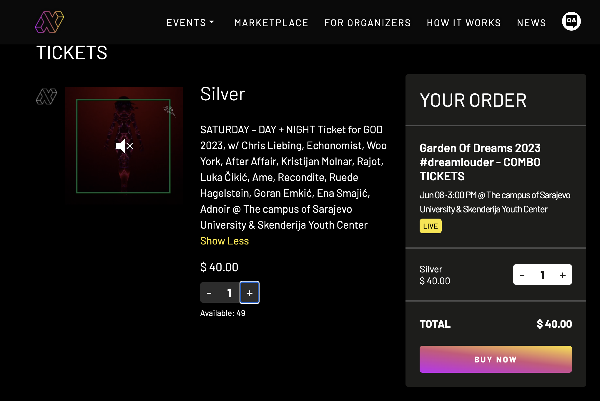

## Selecting payment method — crypto or credit card

With tickets selected, clicking the `BUY NOW` button bings up a payments type selector. Choose whether you prefer to use crypto or a credit card.

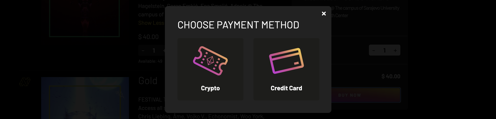

### Credit card — providing necessary information

If you've chosen to use a credit card the required information will be requested.

### Credit card — completing your purchase

Selecting the `PURCHASE` button will, after a moment, display a success message. A few seconds later your ticket(s) appear in your wallet.

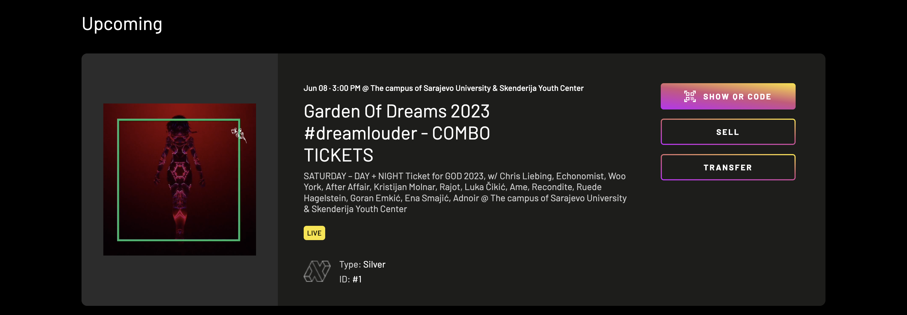

### Crypto — paying from funds in your wallet

If you chose "crypto" as your purchasing method, the following pop-up will appear, allowing you to select which of the supported cryptocurrencies are to be used. The total purchase amount is shown. When ready, click the `BUY NOW` button.

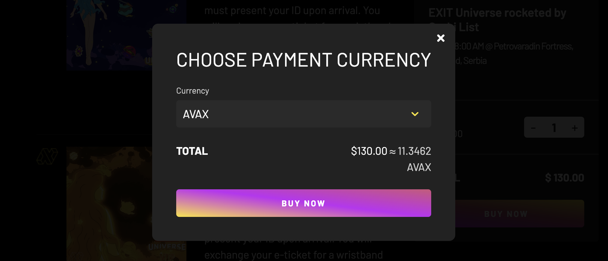

Your wallet will request your permission to initiate the transaction with your digital signature. Click the `Allow` button to proceed.

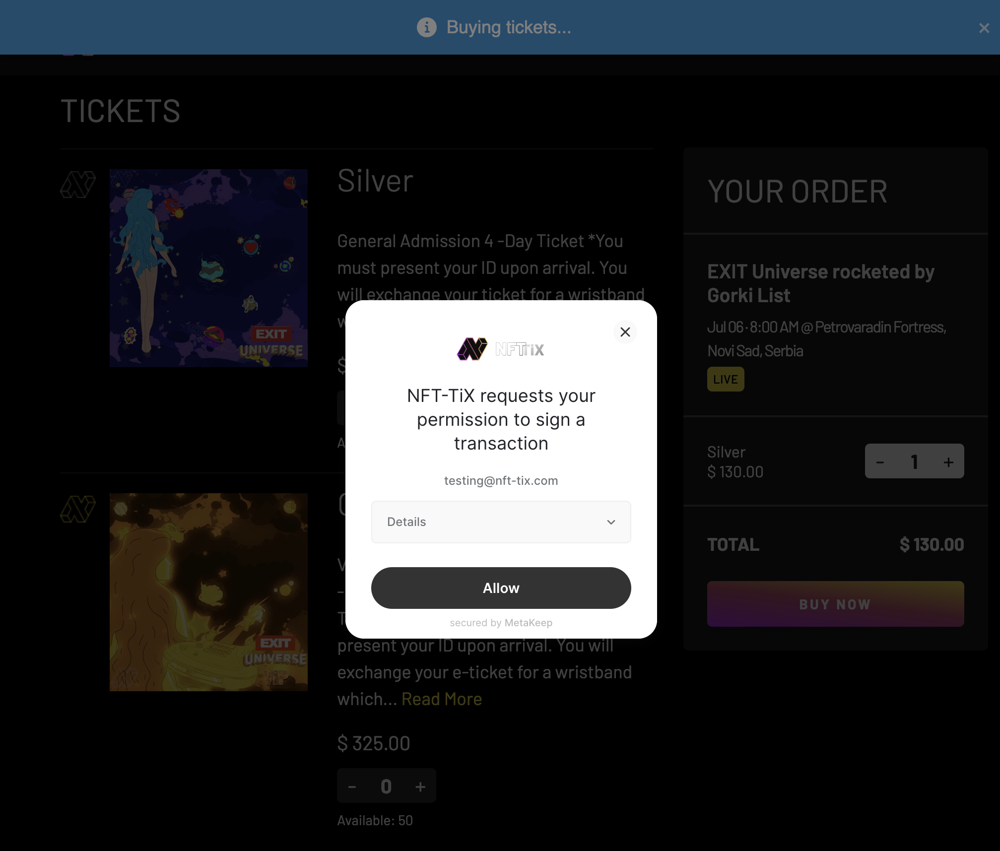

While the transaction is underway status messages will appear. This should take a few moments.

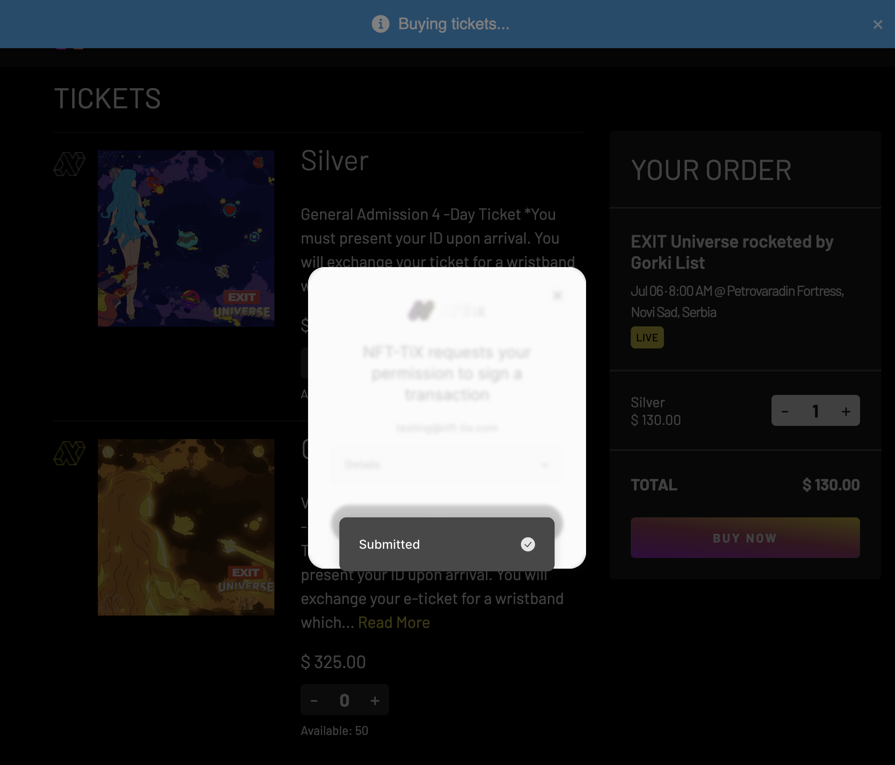

After the cryto is transferred, the tickets will be handed to you, and the system will display a success message. Your ticket(s) are now in your wallet.

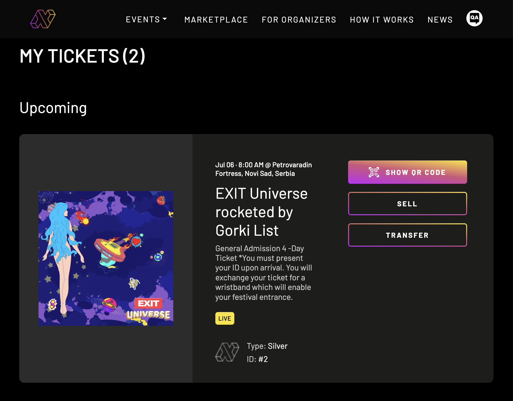

## Additional ticket operations

Purchased tickets offers several operations at this point.

### Show QR code

A QR code — useful for sharing ticket information — may be requested through the `SHQW QR CODE` button.

Your wallet will ask permission to send a signed message to authorize the display of the QR code.

Thereafter a QR code will be displayed.

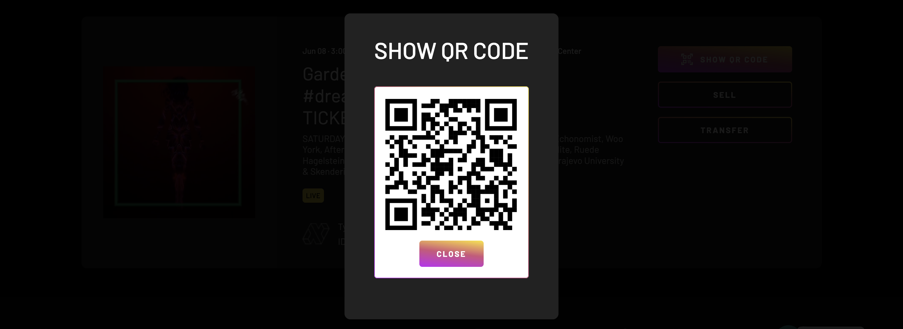

### Sell

Selecting the `SELL` button of any ticket in your wallet will generate a return bill of sale, including restocking fees. Clicking the `COMPLETE LISTING` button sell your ticket.

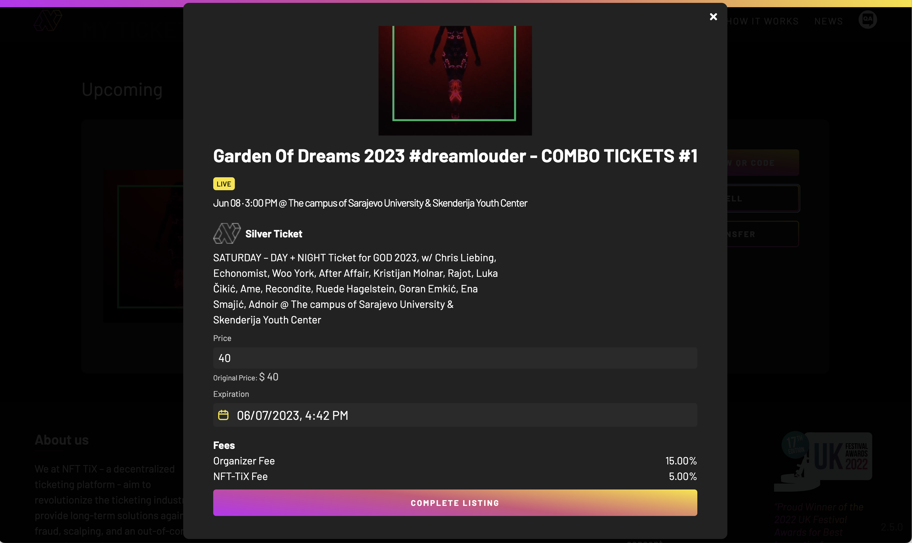

### Transfer

Selecting the `TRANSFER` button of any ticket in your wallet will generate a transfer authorization form. Click the `TRANSFER TICKET` button to continue.

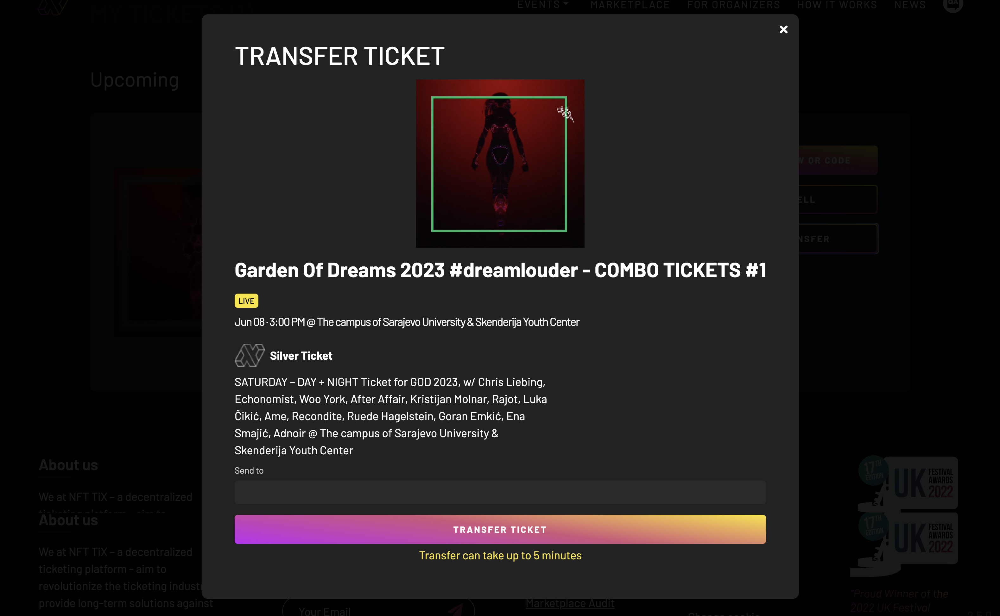

In the 'Send to' text box provide the wallet code of the NFT-TiX member who will receive this ticket. Click the `TRANSFER TICKET` button to continue.

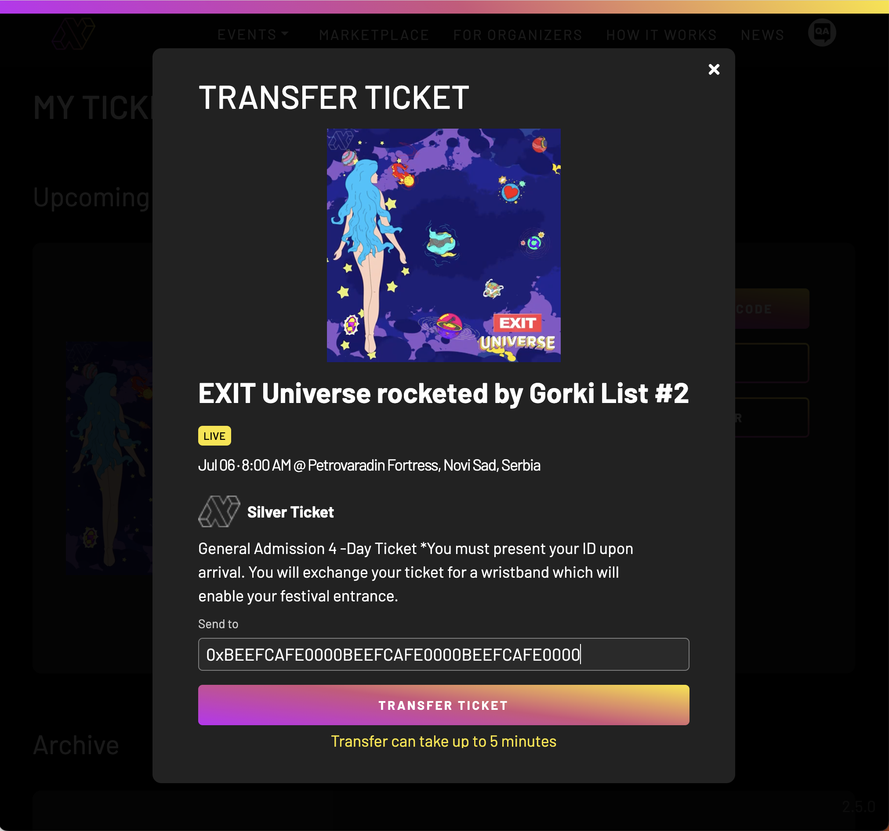

Your wallet will ask permission to send a signed message to authorize the display of the QR code. Click `Allow` to continue.

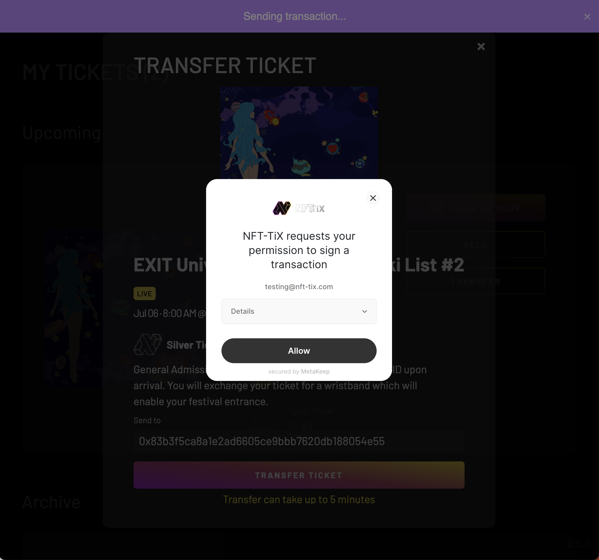

While the ticket tranfer is underway status messages will appear. This should take a few moments.

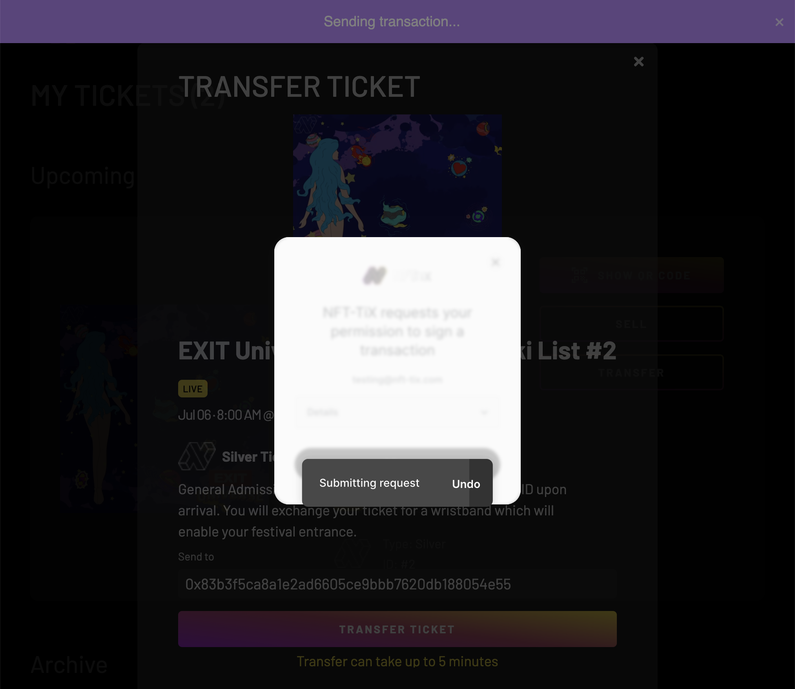

A success message should appear, and the transferred ticket is no longer in your wallet.

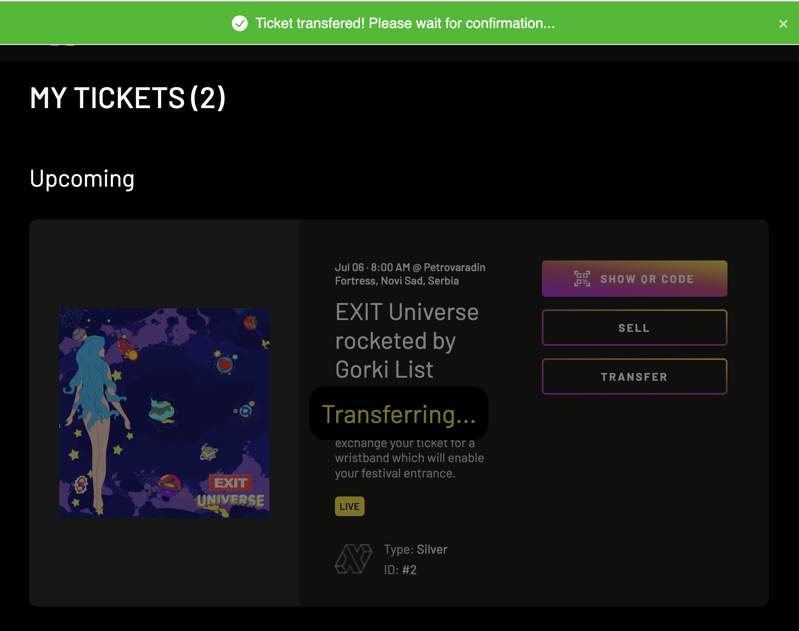
