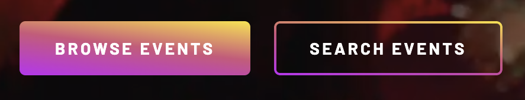
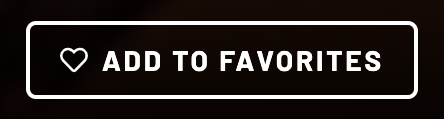
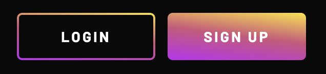

# Getting Started

Tickets aren’t just an entry credential anymore. Own the moment in time. The moment and experience are captured in a single NFT.

What follows is our website support documentation. Read on to see the features and capabilities we've currently implemented.

## Getting started — login or sign up to browse and search

Welcome! We're thrilled that you're here to experience tickets without the worry about fraud, difficulties in reselling tickets to events you can't attend, and the fear of losing or damaging paper ticktes.

The primary way to use our website is to browse and search events. Once you find something interesting you may want to add it to a favorites list or buy that ticket.

For advanced features and functionality you'll need to **[create an account](./signup/README.md)** or log into your previously created account.

Please create and account and come back here. Then we can explore more of what our site offers.

## The top actions bar

The **[Top actions bar](./top_bar/README.md)** contains site-wide shortcuts to the most-used functionality. (The linked page goes into greater depth.)

## My Account

The **[My Accounts](./my-account/README.md)** user avatar image leads the attendee to personalized information and actions. (The linked page goes into greater depth.)