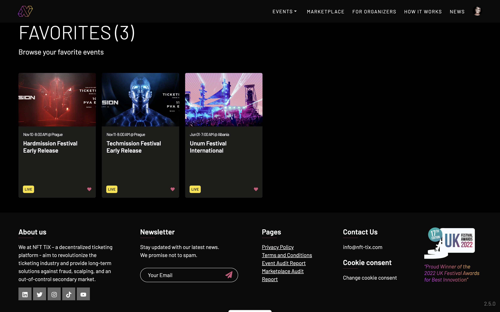
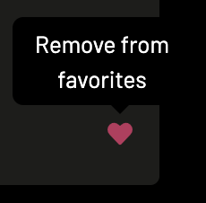

# NFT-TiX — Favorites

When logged into the NFT-TiX website, clicking on your user avatar in the upper-right brings up a series of links relating to your account. Choosing ``Favorites`` will bring up a page which displays events you've previously favorited (by clicking on the heart icon).

Note: Favorites works only after you've **[created an account](./signup/README.md)** and are logged in.

The following screenshot shows a user with three favorited events.

| GitHub Issue |
| :---- |
| [https://github.com/nfttix/documentation/issues/6](https://github.com/nfttix/documentation/issues/6) |

</a>

Favorited events may be unfavorited by clicking on that event's heart icon. (As you mouse over the heart the text "Remove from favorites" will appear.)

</a>

