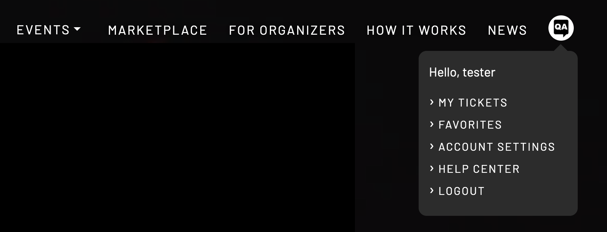

# My Account

Mousing over your account's avatar at the upper right (or tapping, on mobile) will show a pop-up for your personalized account information.

**[My tickets](https://nft-tix.com/user/my-tickets)** shows the attendee which tickets have already been purchased.

**[Favorites](./favorites/README.md)** shows the attendee which events have been favorited by clicking on the heart icon that appears alongside each event browsed.

**[Account settings](https://nft-tix.com/user)** leads the attendee to specifics about their personal user account, including the ability to display a personal avatar, manage the wallet connected with the account, etc.

**[Help center](https://nft-tix.com/how-it-works#ask)** leads the attendee to an email contact form at the bottom of the **How it works** page.

**Logout** immediately logs out the attendee's account.