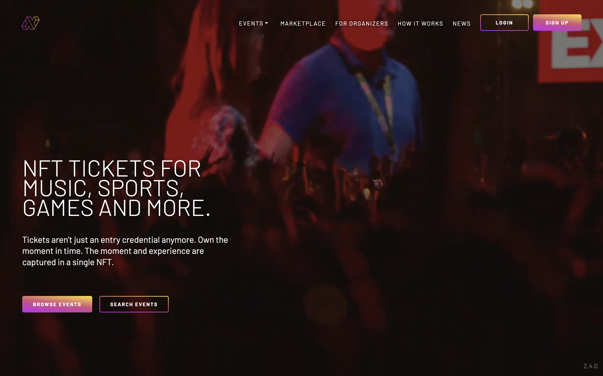
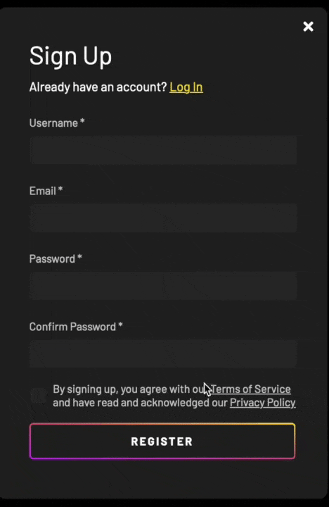
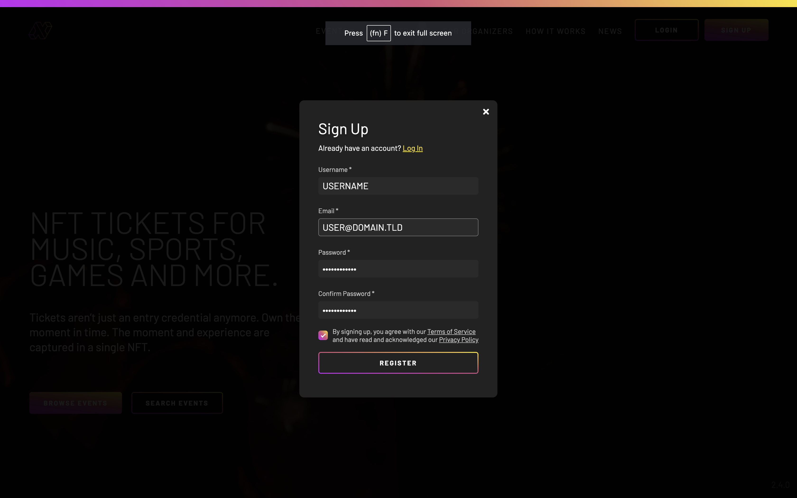
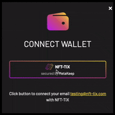
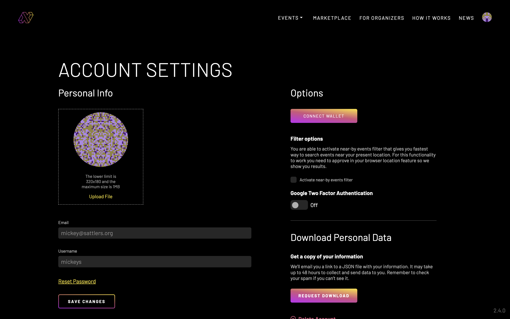
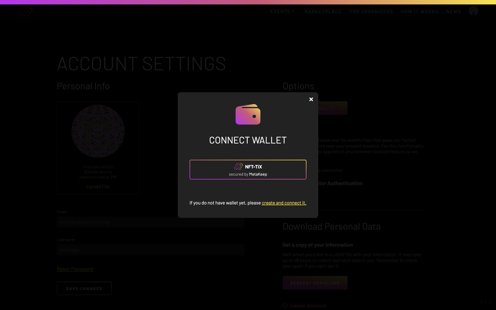
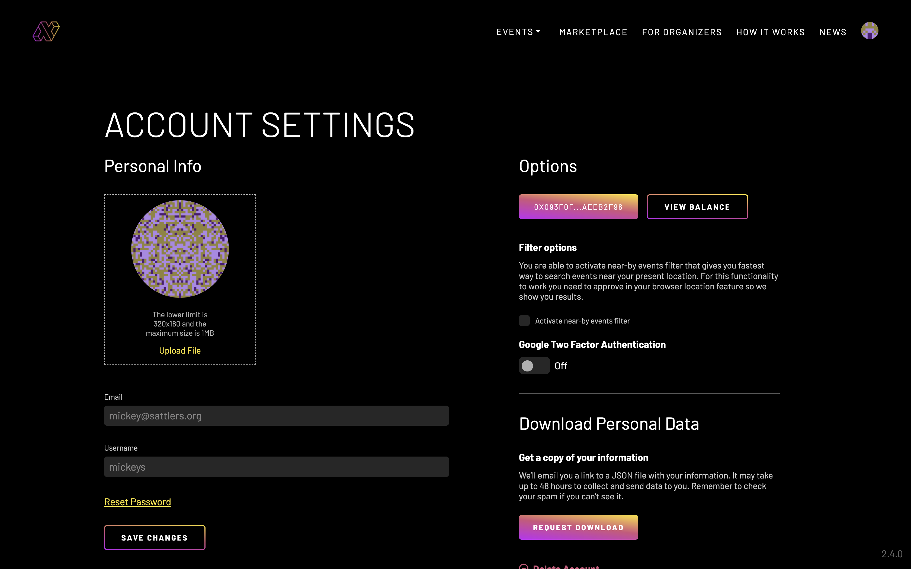

# Signing Up

# 1. Visit our website to create an account

Sign up to NFT-TiX by visiting [nft-tix.com](https://nft-tix.com/).

# 2. Provide basic contact information

Clicking the "Sign Up" button (at the upper right) and provide your basic contact information and a password.

<!--

-->

# 3. Create a new wallet

You will then be given a chance to create a new wallet for us to hold your tickets. You will be able to choose other wallets later. Click on the "NFT-TIX secured by MetaKeep" button.

Grant the permission to sign the new wallet.

For added security a one-time passcode (OTP) will be sent to your email address. Please enter that passcode in the pop-up text box.

# 4. View your new account

Once done, your new account details will be shown.

# *** Actually connect your wallet ***

Clicking on the "Connect Wallet" button again brings up the wallet picker. Additional wallet types are also shown.

Once again, click on the "NFT-TIX secured by MetaKeep" button.

You are once again shown your account details, now with the connected wallet properly displayed.

# 5. Explore our site

You may now return to [nft-tix.com](https://nft-tix.com/) to explore our site.