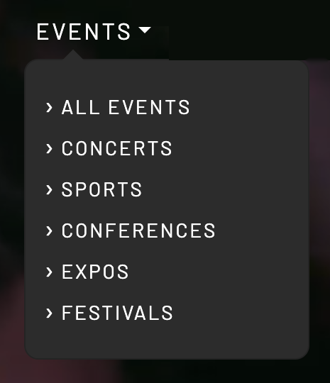
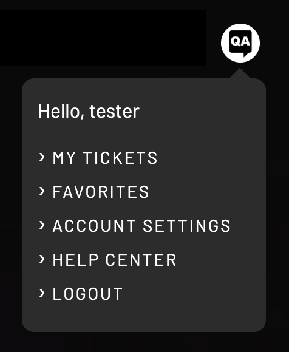

# Top Navigation Bar

Atop each page of the [NFT-TiX](https://nft-tix.com/) website is a Top Navigation Bar which contains shortcuts to the most-used website functionality. 

Of particular interest are the action-oriented entry points: events (for browsing by event type), marketplace (for browsing with more advanced filtering), and the user account shortcut (for accessing per-user settings).

The informational entry points, **For Organizers** and **How It Works** provide painless transitions into concepts and workflows central to NFT-TiX.

## Events

Mousing over the [Events](https://nft-tix.com/events) element shows a pop-up with the various event types. This is the quickest way to begin browsing tickets for purchase.

## Marketplace

[Marketplace](https://nft-tix.com/marketplace) is similar to Events. More detailed filtering options make it even easier to winnow out events which aren't currently of interest.

## For organizers

[For Organizers](https://nft-tix.com/organizers) is the entry portal to those who want to understand how selling through NFT-TiX operates. That page also provides a simple for organizers to begin their sales journey.

## How it works



General knowledge is available through the [How it works](https://nft-tix.com/how-it-works) link. This information is broken up into

* General introduction
* For attendees
* For organizers
* Frequently-asked questions

## News

The [News](https://nft-tix.com/news) link leads to a collection of news items and educational coverage of real-world NFT-TiX event deployments.

## Account settings

The Account settings avatar pop-up directs attendees to personal information grouped as

* My tickets
* Favorites
* Account settings
* Help center
* Logout